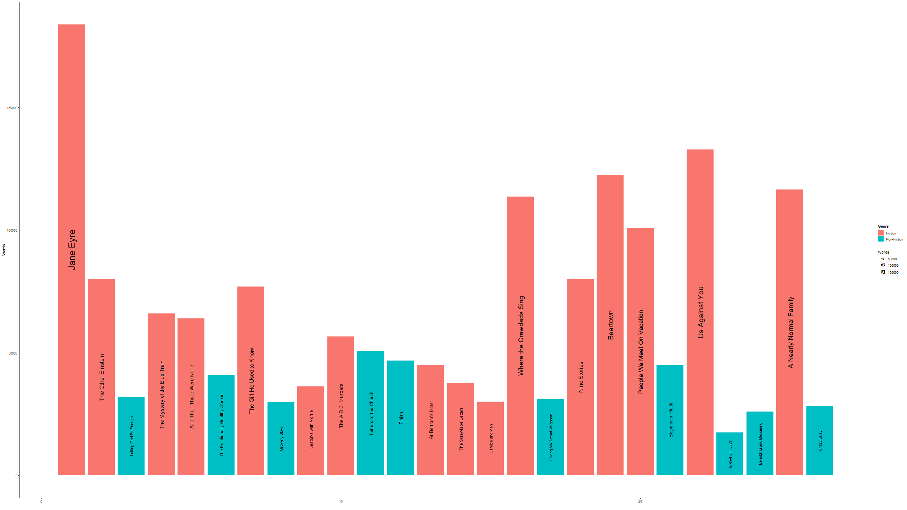
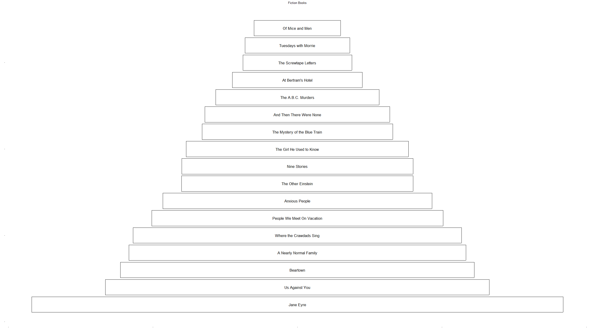

# Books

## Goal

My goal is to make a visually appealing graph of all the books I read in 2022. Ideally the books are in semi-chronological order with the height varying by length of the book. I want the titles of the books to appear vertically on the bar chart to mimic an actual book with the title on the spine. The overall concept is fairly simple, but my hope is to learn a lot about themes and other ways to make the graph more visually appealing. Each day that I work on this project, I will post the current version of the graph here so that I can see how the design progresses from beginning to end. The final graph will be posted here (and maybe on Twitter if it still exists) on January 1, 2023.

## Day 1

Much more was accomplished in this first effort than I anticipated. The general idea is in fact achievable, however, there are still a lot of upgrades and tweaks I want to make.

To improve: get rid of word size legend, make smaller titles more readable, remove/edit axes, add title, add book covers?, add title, add list of favorites

## Day 2

Today the goal was to get a visual of books stacked on top of each other, from smalles to largest. I whittled the data down to just fiction books for this graphic. Lacks color and frills, but I did learn how to make boxes to give the impression of a book instead of just using bar charts. This is kind of a play on a pyramid plot, although much simpler.

To improve: more color, maybe bigger titles, look more like books, highlight favorites in some way
